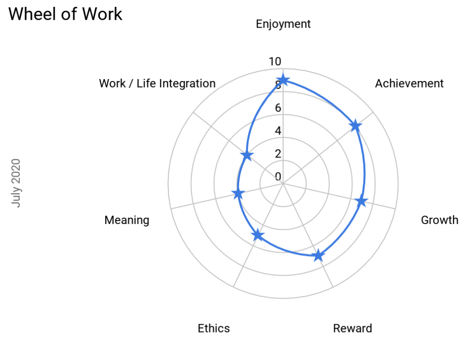

# Personal Growth

- [ally] (Be a good ally and stand up for equality)
- [coach] (Moving from Mentor to Coach)
- [coder] (Complete a side hustle)
- [impact] (Make an impact at work)
- [father] (Fearless chef, proud pedagogue)
- [notoriety] (Become respected in my industry)

[//]: # (Remember `Ctrl`+`Click` creates a new file when editing in VS Code)

## Wheel of work

The [wheel of work] (https://docs.google.com/spreadsheets/d/1sA1i5l1mpEgJQ7pGiO1t6HaUarpiFw48fw8iQL_UHSY/edit?usp=sharing) helps individuals find gaps in their motivations and focus effort on how to make adjustments in the behviour that might affect their motivations.

## Other links

- [todo]
- [Home](/)

